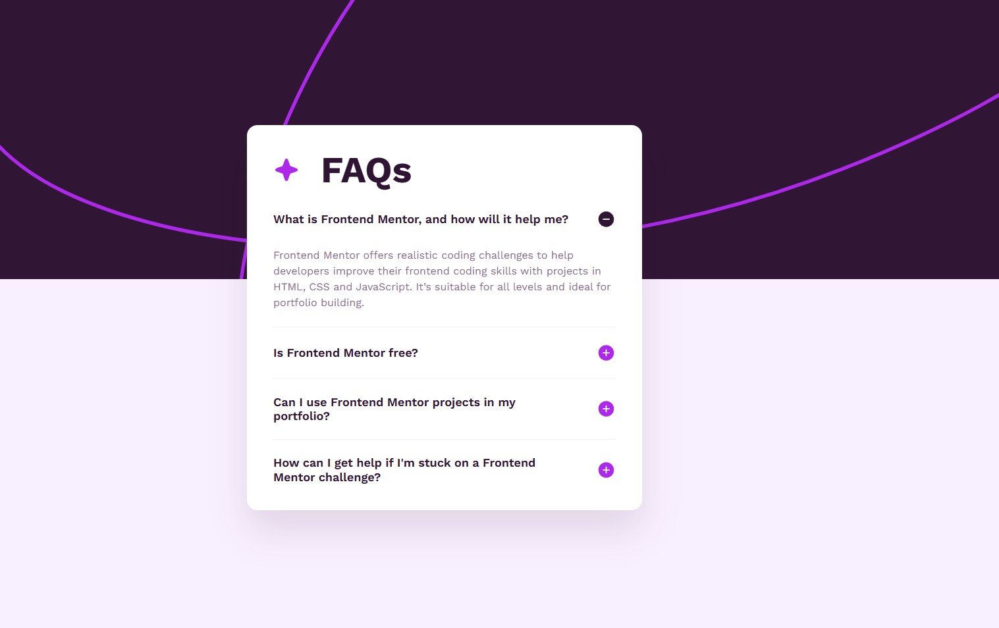

# Frontend Mentor - FAQ Accordion Solution

This is a solution to the **FAQ accordion** challenge on Frontend Mentor. The project is built with semantic HTML, responsive CSS, and JavaScript for accordion interactivity.

## Table of contents

* [Overview](#overview)

  * [The challenge](#the-challenge)
  * [Screenshot](#screenshot)
  * [Links](#links)
* [My process](#my-process)

  * [Built with](#built-with)
  * [What I learned](#what-i-learned)
  * [Continued development](#continued-development)
* [Author](#author)
* [Acknowledgments](#acknowledgments)

## Overview

### The challenge

Users should be able to:

* Hide and show the answer to each question
* View the optimal layout for the interface depending on their device screen size
* See hover and focus states for interactive elements
* Navigate the accordion using accessible buttons

### Screenshot



### Links

* Solution URL: https://github.com/shigureyn/faq-accordion.git
* Live Site URL: https://shigureyn.github.io/faq-accordion/

## My process

### Built with

* Semantic HTML5
* CSS custom properties
* Flexbox
* CSS Grid
* Mobile-first workflow
* Responsive `clamp()` values
* JavaScript
* Accessible accordion pattern
* Local `@font-face` fonts

### What I learned

In this project, I practiced building an accessible accordion component with semantic HTML and JavaScript.

I used `aria-expanded` to describe the current state of each FAQ button and `aria-controls` to connect each button with its related answer.

```html
<button
  class="faq-button"
  type="button"
  aria-expanded="false"
  aria-controls="faq-answer-1"
>
```

I also used the `hidden` attribute to make answers hidden by default and then toggled it with JavaScript.

```js
button.setAttribute("aria-expanded", String(!isExpanded));
answer.hidden = isExpanded;
```

For the layout, I used responsive CSS with `clamp()` to make spacing, typography, and card sizing adapt smoothly between mobile and desktop screens.

```css
.faq {
  inline-size: 100%;
  max-inline-size: 37.5rem;
  padding: clamp(1.5rem, 1.148rem + 1.5vw, 2.5rem);
}
```

### Continued development

In future projects, I want to continue improving:

* Accessible JavaScript components
* Keyboard-friendly interactive elements
* Responsive layouts with fewer media queries
* Clean CSS structure
* Better usage of ARIA attributes

## Author

* GitHub - [@shigureyn](https://github.com/shigureyn)
* Frontend Mentor - [@shigureyn](https://www.frontendmentor.io/profile/shigureyn)

## Acknowledgments

Thanks to Frontend Mentor for providing this challenge and design resources.
